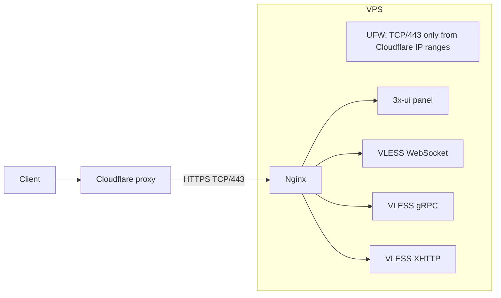

# 3x-ui-cf-setup

<p align="center">
  
</p>


Automated deployment of a Cloudflare-fronted 3x-ui/Xray server. It installs
and configures 3x-ui, Nginx, wildcard TLS, UFW, Cloudflare origin protection,
VLESS transports, subscriptions, routing, and optional host hardening.

## What it sets up



| Component | Configuration |
|---|---|
| Panel | Private loopback listener, proxied by Nginx on its own subdomain and secret path |
| VLESS/WS | Loopback Xray listener proxied through Nginx HTTPS |
| VLESS/gRPC | Loopback Xray listener proxied through Nginx HTTP/2 |
| VLESS/XHTTP | Loopback Xray listener using `packet-up`, proxied with Nginx `grpc_pass` |
| Subscription | Loopback listener proxied through the panel hostname |
| TLS | Let's Encrypt wildcard certificate via Cloudflare DNS-01 |
| Origin firewall | TCP/443 allowed only from Cloudflare's published IPv4/IPv6 ranges; direct origin HTTPS is denied |
| Routing | Direct traffic plus WARP routing for configured Russian/OpenAI rules; private and BitTorrent traffic blocked |

## Scripts

| Script | Role |
|---|---|
| `setup.sh` | Main entry point. Installs, updates, configures, verifies, and uninstalls the complete stack. |
| `setup-3x-ui.sh` | Internal helper that installs/reuses 3x-ui and creates WS, gRPC, XHTTP, subscription, and Xray routing configuration. |
| `harden-host.sh` | Optional host hardening for clock sync, DNS-over-TLS, sysctl, ICMP, TTL, banners, and BBR. Invoked by `setup.sh`. |

Use `setup.sh` for normal operation. The helper scripts can be run directly only for their respective `--uninstall` actions.

## Prerequisites

- Debian or Ubuntu VPS; run as `root`.
- Domain hosted by Cloudflare.
- Cloudflare API token with `Zone:DNS:Edit` permission.
- All public hostnames used by this setup must remain **orange-cloud proxied**. Direct origin access is intentionally blocked by UFW.

## Install

```bash
git clone https://github.com/andletenkov/3x-ui-cf-setup.git
cd 3x-ui-cf-setup
chmod +x setup.sh setup-3x-ui.sh harden-host.sh
sudo ./setup.sh
```

The setup asks for the base domain, panel/VLESS subdomains, email, and internal
ports. It generates unique paths and ports when no saved values exist. 3x-ui
creates the panel credentials and secret panel path itself; the resulting
credentials and VLESS links are printed at completion.

New VLESS clients are explicitly enabled by default.

### Optional fallback page

By default, unmatched paths on the VLESS hostname return `404`. To serve a
single fallback page at `/`, pass a readable HTML file:

```bash
sudo FALLBACK_HTML_PATH=./examples/fallback.html ./setup.sh
```

The page is copied to `/etc/nginx/3xui-proxy-fallback.html`. Only `/` serves
the page; unmatched paths still return `404`. Run without `FALLBACK_HTML_PATH`
to remove the installed fallback page and restore `404` at `/`.

### XHTTP through Cloudflare

The generated XHTTP inbound uses:

```json
{
  "network": "xhttp",
  "security": "none",
  "xhttpSettings": { "path": "/api/vN/...", "mode": "packet-up" }
}
```

`security: none` applies only to the loopback Nginx-to-Xray hop; Nginx
terminates public TLS. XHTTP `packet-up` sends session and sequence suffixes
below its configured path, so Nginx forwards the complete path prefix with
`grpc_pass`.

In Cloudflare, enable **Network → gRPC** for the zone. Keep the VLESS hostname
orange-cloud proxied. Import the XHTTP URI generated by the panel or setup
output; it must use the same path and `mode=packet-up`.

## Configuration reference

| Variable | Default / source | Notes |
|---|---|---|
| `BASE_DOMAIN` | prompted | Required base domain |
| `PANEL_SUBDOMAIN` | `admin` | Must differ from `VLESS_SUBDOMAIN` |
| `VLESS_SUBDOMAIN` | `vpn` | Cloudflare-proxied VLESS hostname |
| `EMAIL` | prompted | Let's Encrypt contact address |
| `SUB_PORT`, `WS_PORT`, `GRPC_PORT`, `XHTTP_PORT` | random free port | Internal loopback ports; all must differ and cannot be `443` |
| `WS_PATH`, `GRPC_SERVICE`, `XHTTP_PATH`, `SUB_PATH` | generated once | Saved and reused on subsequent runs; XHTTP uses an `/api/vN/...` path |
| `CLOUDFLARE_API_TOKEN` | prompted, hidden | Required unless exported in the environment |
| `FALLBACK_HTML_PATH` | unset | Optional readable single-file HTML fallback served only at `/` on the VLESS host |
| `XUI_VERSION` | latest stable | Optional environment variable for a fresh 3x-ui installation, for example `v3.4.0` |
| `PANEL_PORT` | random free port | Reserved by `setup.sh` before installing 3x-ui |
| `PANEL_PATH`, panel username/password | generated by 3x-ui | Printed at completion and stored by the upstream installer |
| `DNS_RESOLVERS`, `DNS_OVER_TLS_MODE`, `DNSSEC_MODE` | Cloudflare DoT defaults | Optional `harden-host.sh` overrides |

## Update safely

```bash
cd 3x-ui-cf-setup
git pull
sudo ./setup.sh
```

Saved settings are loaded automatically. Re-running updates Nginx, UFW,
Cloudflare IP ranges, certificates/hooks, host-hardening settings, and missing
inbounds. Existing inbounds and clients are not recreated or changed, so active
client connections are preserved.

Cloudflare origin ranges are refreshed every time `setup.sh` runs. Cloudflare
does not publish a guaranteed change cadence; run updates periodically to
refresh the firewall rules.

### Pin the 3x-ui version

```bash
sudo XUI_VERSION=v3.4.0 ./setup.sh
```

Without `XUI_VERSION`, a fresh 3x-ui installation uses the latest stable
upstream release. It is ignored when 3x-ui already exists.

## Uninstall

```bash
sudo ./setup.sh --uninstall
```

This removes the Nginx site, Cloudflare real-IP configuration, Cloudflare-only
UFW rules, Certbot hook, Cloudflare token, saved state, 3x-ui, and host
hardening. The wildcard certificate is retained by default to avoid Let's
Encrypt issuance limits.

```bash
sudo ./setup.sh --uninstall --delete-cert
```

Use the extra flag only when the certificate should also be removed.

## Host hardening

`setup.sh` runs host hardening as a best-effort step. To apply or revert it
separately:

```bash
sudo ./harden-host.sh
sudo ./harden-host.sh --uninstall
```

Environment overrides:

```bash
sudo DNS_RESOLVERS='9.9.9.9#dns.quad9.net 149.112.112.112#dns.quad9.net' \
  DNS_OVER_TLS_MODE=yes DNSSEC_MODE=yes ./harden-host.sh
```

## Security model and limitations

- Normal Cloudflare proxying does not support direct QUIC/Hysteria2 or REALITY
  to the origin. Do not add DNS-only records for this VPS if hiding the origin
  IP is a goal.
- Cloudflare's proxy hides the origin from normal DNS users; the UFW rules also
  reject direct TCP/443 traffic from non-Cloudflare sources.
- The Cloudflare API token and generated state files use mode `600`.
- SSH is never modified by `setup.sh`; ensure your own SSH UFW access exists
  before enabling UFW on a new host.

## Generated files

| Path | Purpose |
|---|---|
| `/etc/nginx/.3xui-proxy.conf` | Saved setup values and client identifiers |
| `/etc/nginx/.3xui-proxy-ports.state` | Ports owned by the setup |
| `/etc/nginx/.3xui-proxy-cloudflare-ips.state` | Cloudflare ranges used for UFW rules |
| `/etc/nginx/conf.d/cloudflare-real-ip.conf` | Cloudflare real-IP trust configuration |
| `/etc/nginx/sites-available/3xui-proxy` | Generated Nginx virtual hosts |
| `/etc/letsencrypt/cloudflare.ini` | Cloudflare DNS API token, mode `600` |
| `/etc/x-ui/install-result.env` | 3x-ui generated panel credentials, mode `600` |

## Test

```bash
brew install bats-core   # or: apt install bats
chmod +x tests/stubs/*
bats tests/install.bats tests/anonymize.bats
```

CI runs ShellCheck and the Bats suite on pushes and pull requests.
