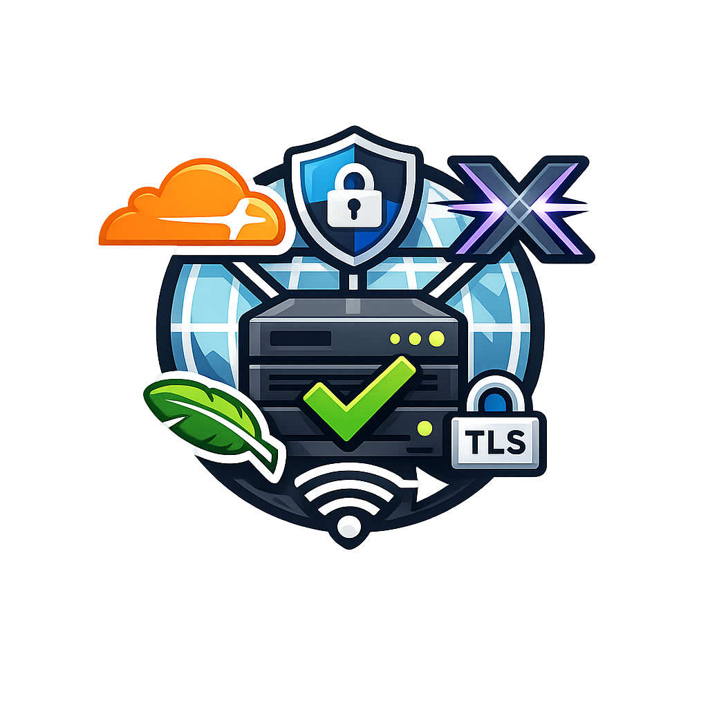
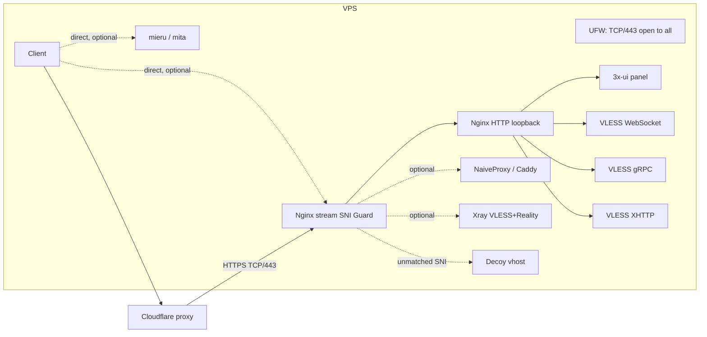

# 3x-ui-cf-setup

<p align="center">
  
</p>


Automated deployment of a 3x-ui/Xray server in one of two **mutually exclusive**
network modes. It installs and configures 3x-ui, Nginx, wildcard TLS, UFW,
subscriptions, routing, and optional host hardening. The mode boundary prevents
CDN-fronted and direct transports from sharing a VPS, which could otherwise
make the CDN origin's IP discoverable and weaken its camouflage.

## What it sets up



This diagram shows the two alternatives, not a combined deployment. In `cdn`
mode only the Cloudflare → Nginx → WS/gRPC/XHTTP branch is created. In
`no-cdn` mode only the direct Reality/Naive branches (plus panel/subscription)
are created; the stream SNI Guard appears when direct traffic shares port 443.

| Component | Configuration |
|---|---|
| Panel | Private loopback listener, proxied by Nginx on its own subdomain and secret path |
| VLESS/WS | Loopback Xray listener proxied through Nginx HTTPS, VLESS Encryption (ML-KEM-768) |
| VLESS/gRPC | Loopback Xray listener proxied through Nginx HTTP/2, VLESS Encryption (ML-KEM-768) |
| VLESS/XHTTP | Loopback Xray listener using `packet-up`, proxied with Nginx `grpc_pass`, VLESS Encryption + XTLS-Vision |
| VLESS/Reality *(`no-cdn`)* | Direct connection, donor-site impersonation, no VLESS Encryption needed |
| NaiveProxy *(`no-cdn`)* | Direct connection, Caddy + forwardproxy, reuses the wildcard cert |
| mieru *(`no-cdn`)* | Direct connection, mita server, own username/password auth, no TLS/SNI/cert |
| Subscription | Loopback listener proxied through the panel hostname |
| TLS | Let's Encrypt wildcard certificate via Cloudflare DNS-01, shared by the CDN inbounds and NaiveProxy |
| Origin firewall | TCP/443 open to everyone -- direct-connection features (Reality, NaiveProxy) need it; the stream SNI Guard, not the firewall, is what keeps random probes off the real inbounds |
| Routing | Direct traffic plus WARP routing for configured Russian/OpenAI rules; private and BitTorrent traffic blocked |

## Scripts

| Script | Role |
|---|---|
| `setup.sh` | Main entry point. Installs, updates, configures, verifies, and uninstalls the complete stack: Nginx, NaiveProxy, the Nginx stream SNI Guard, and 3x-ui install/inbound/subscription/Xray-routing configuration (all in one script -- no subprocess boundary). |
| `harden-host.sh` | Optional host hardening for clock sync, DNS-over-TLS, sysctl, ICMP, TTL, banners, and BBR. Invoked by `setup.sh`. |

Use `setup.sh` for normal operation. `harden-host.sh` can be run directly only for its `--uninstall` action.

## Prerequisites

- Debian or Ubuntu VPS; run as `root`.
- Domain hosted by Cloudflare.
- Cloudflare API token with `Zone:DNS:Edit` permission.
- Choose **one** mode before installing; never place CDN and direct transports
  on the same VPS with this installer.
- In `cdn` mode, the panel and VLESS hostname must remain **orange-cloud proxied**.
- In `no-cdn` mode, Reality and NaiveProxy hostnames must be **DNS-only (grey
  cloud)**. They connect directly to the VPS and cannot pass through Cloudflare.
- TCP/443 is open to the internet. In `no-cdn` mode the Nginx stream SNI Guard
  routes direct traffic by SNI and sends unmatched SNI to a decoy.

## Install

```bash
git clone https://github.com/andletenkov/3x-ui-cf-setup.git
cd 3x-ui-cf-setup
chmod +x setup.sh harden-host.sh
sudo ./setup.sh
```

The setup first requires a CDN choice. Set `CDN_MODE=true` (or `yes`, `1`,
`on`) for CDN inbounds, or `CDN_MODE=false` (or `no`, `0`, `off`) for direct
inbounds; it can also be chosen interactively. The choice is persisted in
`/etc/nginx/.3xui-proxy.conf` and validated on every
run. 3x-ui creates panel credentials and its secret panel path itself.

### Installation modes

| `CDN_MODE` | Created inbounds | DNS/proxy requirement |
|---|---|---|
| true-compatible | VLESS WebSocket, gRPC, XHTTP/TLS | VLESS hostname is orange-cloud proxied; no Reality or NaiveProxy is allowed |
| false-compatible | Hysteria2, VLESS TCP+Reality, and/or NaiveProxy | Direct hostnames are DNS-only; at least one direct inbound is required |

`xhttp-reality` is reserved for a future `no-cdn` release. Hysteria2 is a
native direct UDP/QUIC inbound and is created when its subdomain is supplied. A `cdn` run clears any saved Reality/Naive settings, so
switching modes is deliberate and cannot leave mixed inbounds behind.

Examples:

```bash
sudo CDN_MODE=true ./setup.sh
sudo CDN_MODE=false ./setup.sh
```

The setup asks for the base domain, panel/VLESS subdomains, email, and internal
ports. It generates unique paths and ports when no saved values exist.

New VLESS clients are explicitly enabled by default.

### Optional fallback page

By default, unmatched paths on the VLESS hostname return `404`. To serve a
single fallback page at `/`, pass a readable HTML file:

```bash
sudo FALLBACK_HTML_PATH=./examples/fallback.html ./setup.sh
```

The page is copied to `/etc/nginx/3xui-proxy-fallback.html`. Only `/` serves
the page; unmatched paths still return `404`. Run without `FALLBACK_HTML_PATH`
to remove the installed fallback page and restore `404` at `/`.

### `cdn`: XHTTP through Cloudflare

The generated XHTTP inbound uses:

```json
{
  "network": "xhttp",
  "security": "none",
  "xhttpSettings": { "path": "/api/vN/...", "mode": "packet-up" }
}
```

`security: none` applies only to the loopback Nginx-to-Xray hop; Nginx
terminates public TLS. XHTTP `packet-up` sends session and sequence suffixes
below its configured path, so Nginx forwards the complete path prefix with
`grpc_pass`.

In Cloudflare, enable **Network → gRPC** for the zone. Keep the VLESS hostname
orange-cloud proxied. Import the XHTTP URI generated by the panel or setup
output; it must use the same path and `mode=packet-up`.

### `cdn`: VLESS Encryption and XTLS-Vision

WS/gRPC/XHTTP inbounds generate an ML-KEM-768 keypair the first time
`setup.sh` runs and reuse it on every rerun. It's applied independently of
Cloudflare's own TLS layer, so Cloudflare (or anything else terminating the
outer TLS session) cannot read the actual proxied payload. XHTTP additionally
gets `flow: xtls-rprx-vision`, which VLESS Encryption unlocks for that
transport (Vision otherwise only works over raw TCP). Reality does not use
VLESS Encryption -- there's no CDN/reverse-proxy TLS termination in front of
it to protect against in the first place.

### `no-cdn`: Hysteria2

Supply a DNS-only Hysteria2 subdomain to create a direct UDP/QUIC inbound. It
listens on UDP/443 by default (TCP/443 remains available to Nginx) and uses
`/etc/letsencrypt/live/<base-domain>/fullchain.pem` and `privkey.pem`: the same
wildcard certificate already issued for `*.BASE_DOMAIN`. Use the exact
Hysteria2 hostname as client SNI, for example `hy2.example.com`; it is covered
by the wildcard certificate and must resolve directly to the VPS. The generated
Hysteria2 authentication and Salamander-obfuscation values are printed at
completion. Salamander intentionally makes this endpoint incompatible with
normal HTTP/3 masquerading; do not configure a Hysteria `masquerade` fallback
on this inbound.

### `no-cdn`: VLESS+Reality

Available only when `INSTALL_MODE=no-cdn`. Leave its prompt blank only if you
instead enable NaiveProxy; `no-cdn` requires at least one direct inbound. If
enabled, you provide:

- a **DNS-only** subdomain (its A/AAAA record must point directly at the VPS,
  proxy status off), and
- a **donor site** for Reality to impersonate -- a real, unrelated, popular
  site (e.g. `github.com`), never a domain of your own. Anyone who reaches
  this inbound without a valid Reality handshake gets transparently relayed
  to the real donor site's real response.

The inbound shares port 443 with everything else via the Nginx stream SNI
Guard, dispatching by the TLS ClientHello's SNI before any TLS termination
happens -- Reality's own TLS session is untouched end-to-end.

### `no-cdn`: mieru (direct connection)

Available only when `INSTALL_MODE=no-cdn`; it may be used alone or alongside
Reality/NaiveProxy/Hysteria2. If enabled, `setup.sh` downloads the latest
[enfein/mieru](https://github.com/enfein/mieru) `mita` server Debian package,
generates a username/password, and applies a server configuration via
`mita apply config` (installed as the `mita` systemd service). See the
upstream [server installation guide](https://github.com/enfein/mieru/blob/main/docs/server-install.md).

Unlike Reality and NaiveProxy, mieru has no TLS/SNI layer at all -- there is
no certificate to issue and nothing for the Nginx stream SNI Guard to route,
so it gets its own dedicated public port (TCP or UDP, chosen at setup time,
default UDP) rather than sharing 443. Its subdomain is a DNS-only record used
solely as a friendly hostname for clients; mieru authenticates purely via the
generated username/password, not the hostname itself. Mind the mieru project's
own [security guide](https://github.com/enfein/mieru/blob/main/docs/security.md)
(e.g. avoiding domestic OSes/browsers) and
[maintenance guide](https://github.com/enfein/mieru/blob/main/docs/operation.md#maintenance--troubleshooting)
for day-2 operations (`mita get users`, `mita describe config`, log locations,
BBR/MTU troubleshooting).

### `no-cdn`: NaiveProxy (direct connection)

Available only when `INSTALL_MODE=no-cdn`; it may be used alone or alongside
Reality. If enabled, `setup.sh`
downloads the latest [klzgrad/naiveproxy](https://github.com/klzgrad/naiveproxy)
release (a Caddy build bundling the naive fork of `forwardproxy`), generates a
username/password, and runs it as a systemd service. Caddy binds loopback
only and reuses the same wildcard certificate as the CDN inbounds -- it does
not run its own ACME flow. It's reached the same way as Reality: via the
Nginx stream SNI Guard on port 443, using its own DNS-only subdomain.

Anyone reaching the NaiveProxy hostname without valid forward-proxy
credentials sees an ordinary decoy webpage (the same content as
`FALLBACK_HTML_PATH`, or a generic default page if that's unset) via Caddy's
`file_server`, not an error.

## Configuration reference

| Variable | Default / source | Notes |
|---|---|---|
| `CDN_MODE` | prompted; true/false-compatible | **Required.** Selects mutually exclusive CDN or direct transport flow |
| `BASE_DOMAIN` | prompted | Required base domain |
| `PANEL_SUBDOMAIN` | `admin` | Must differ from `VLESS_SUBDOMAIN` |
| `VLESS_SUBDOMAIN` | `vpn` | Cloudflare-proxied VLESS hostname |
| `EMAIL` | prompted | Let's Encrypt contact address |
| `SUB_PORT`, `WS_PORT`, `GRPC_PORT`, `XHTTP_PORT` | random free port | Internal loopback ports; all must differ and cannot be `443` |
| `WS_PATH`, `GRPC_SERVICE`, `XHTTP_PATH`, `SUB_PATH` | generated once | Saved and reused on subsequent runs; XHTTP uses an `/api/vN/...` path |
| `CLOUDFLARE_API_TOKEN` | prompted, hidden | Required unless exported in the environment |
| `FALLBACK_HTML_PATH` | unset | Optional readable single-file HTML fallback served only at `/` on the VLESS host |
| `XUI_VERSION` | latest stable | Optional environment variable for a fresh 3x-ui installation, for example `v3.4.0` |
| `PANEL_PORT` | random free port | Reserved by `setup.sh` before installing 3x-ui |
| `PANEL_PATH`, panel username/password | generated by 3x-ui | Printed at completion and stored by the upstream installer |
| `DNS_RESOLVERS`, `DNS_OVER_TLS_MODE`, `DNSSEC_MODE` | Cloudflare DoT defaults | Optional `harden-host.sh` overrides |
| `REALITY_SUBDOMAIN` | blank (disabled) | Optional; must be **DNS-only**, not orange-cloud |
| `REALITY_DEST` | prompted if Reality enabled | Real, unrelated donor site to impersonate (e.g. `github.com`); never a domain of `BASE_DOMAIN` |
| `REALITY_PORT`, `REALITY_SHORT_ID`, `REALITY_PRIVATE_KEY`, `REALITY_PUBLIC_KEY` | generated once | Saved and reused on subsequent runs |
| `NAIVE_SUBDOMAIN` | blank (disabled) | Optional; must be **DNS-only**, not orange-cloud |
| `HYSTERIA_SUBDOMAIN` | blank (disabled) | Optional Hysteria2 hostname; must be **DNS-only** |
| `MIERU_SUBDOMAIN` | blank (disabled) | Optional mieru hostname; must be **DNS-only**; used only as a client-facing label, not for routing |
| `MIERU_PORT` | random free port | Public TCP or UDP port; not shared with 443 |
| `MIERU_PROTOCOL` | `UDP` | `TCP` or `UDP`, per mieru's [protocol guide](https://github.com/enfein/mieru/blob/main/docs/protocol.md) |
| `MIERU_USERNAME`, `MIERU_PASSWORD` | generated once | Saved and reused on subsequent runs |
| `HYSTERIA_PORT` | `443`/UDP | Public UDP listener; shares the number, not the protocol, with Nginx TCP/443 |
| `HYSTERIA_AUTH` | generated once | Hysteria2 client authentication secret |
| `HYSTERIA_OBFS_PASSWORD` | generated once | Salamander UDP obfuscation password; must match the client |
| `NAIVE_PORT`, `NAIVE_USERNAME`, `NAIVE_PASSWORD` | generated once | Saved and reused on subsequent runs |
| `NGINX_CDN_PORT`, `NGINX_DECOY_PORT` | random free port | Only reserved when Reality or NaiveProxy is enabled |

## Update safely

```bash
cd 3x-ui-cf-setup
git pull
sudo ./setup.sh
```

Saved settings are loaded automatically. Re-running updates Nginx, UFW,
Cloudflare IP ranges, certificates/hooks, host-hardening settings, and missing
inbounds. Existing inbounds and clients are not recreated or changed, so active
client connections are preserved.

Cloudflare origin ranges are refreshed every time `setup.sh` runs. Cloudflare
does not publish a guaranteed change cadence; run updates periodically to
refresh the firewall rules.

### Pin the 3x-ui version

```bash
sudo XUI_VERSION=v3.4.0 ./setup.sh
```

Without `XUI_VERSION`, a fresh 3x-ui installation uses the latest stable
upstream release. It is ignored when 3x-ui already exists.

## Uninstall

```bash
sudo ./setup.sh --uninstall
```

This removes the Nginx site, the stream SNI Guard config (and its `nginx.conf`
include), Cloudflare real-IP configuration, UFW rules, Certbot hook,
Cloudflare token, saved state, 3x-ui, NaiveProxy (service, binary, Caddyfile),
mieru (`mita` service and package, `/etc/mieru`), and host hardening. The
wildcard certificate is retained by default to avoid Let's Encrypt issuance
limits.

```bash
sudo ./setup.sh --uninstall --delete-cert
```

Use the extra flag only when the certificate should also be removed.

## Host hardening

`setup.sh` runs host hardening as a best-effort step. To apply or revert it
separately:

```bash
sudo ./harden-host.sh
sudo ./harden-host.sh --uninstall
```

Environment overrides:

```bash
sudo DNS_RESOLVERS='9.9.9.9#dns.quad9.net 149.112.112.112#dns.quad9.net' \
  DNS_OVER_TLS_MODE=yes DNSSEC_MODE=yes ./harden-host.sh
```

## Security model and limitations

- Cloudflare's proxy cannot terminate/forward REALITY or NaiveProxy traffic --
  those features intentionally use separate, DNS-only hostnames that bypass
  Cloudflare entirely. Enabling either of them means the VPS's real IP is
  discoverable via those specific DNS records (though not via the panel/VLESS
  CDN hostnames, which stay proxied).
- TCP/443 is open to everyone once Reality or NaiveProxy is enabled -- the
  Nginx stream SNI Guard, not the firewall, is what decides whether a given
  connection reaches a real inbound or the decoy vhost, based on the TLS
  ClientHello's SNI.
- The Cloudflare API token and generated state files use mode `600`.
- SSH is never modified by `setup.sh`; ensure your own SSH UFW access exists
  before enabling UFW on a new host.
- VLESS Encryption (WS/gRPC/XHTTP) and Reality's own handshake are
  independent of Cloudflare's TLS layer, so this setup does not rely on
  Cloudflare being trustworthy w.r.t. reading the actual proxied payload for
  either of them.

## Generated files

| Path | Purpose |
|---|---|
| `/etc/nginx/.3xui-proxy.conf` | Saved setup values and client identifiers |
| `/etc/nginx/.3xui-proxy-ports.state` | Ports owned by the setup |
| `/etc/nginx/.3xui-proxy-cloudflare-ips.state` | Cloudflare ranges used for UFW rules |
| `/etc/nginx/conf.d/cloudflare-real-ip.conf` | Cloudflare real-IP trust configuration |
| `/etc/nginx/sites-available/3xui-proxy` | Generated Nginx virtual hosts (CDN + decoy vhost) |
| `/etc/nginx/stream.d/3xui-proxy-sni-guard.conf` | Stream SNI Guard config; only present when Reality or NaiveProxy is enabled |
| `/etc/letsencrypt/cloudflare.ini` | Cloudflare DNS API token, mode `600` |
| `/etc/x-ui/install-result.env` | 3x-ui generated panel credentials, mode `600` |
| `/etc/caddy/Caddyfile` | NaiveProxy config, present only when enabled |
| `/etc/systemd/system/caddy.service` | NaiveProxy systemd unit, present only when enabled |
| `/etc/mieru/server_config.json` | mieru (mita) server config, mode `600`, present only when enabled |
| `/var/www/naiveproxy` | Shared decoy content root (NaiveProxy's `file_server` and the SNI Guard's decoy vhost) |
| `/usr/bin/caddy` | Downloaded NaiveProxy binary |

## Test

```bash
brew install bats-core   # or: apt install bats
chmod +x tests/stubs/*
bats tests/install.bats tests/anonymize.bats
```

CI runs ShellCheck and the Bats suite on pushes and pull requests.
