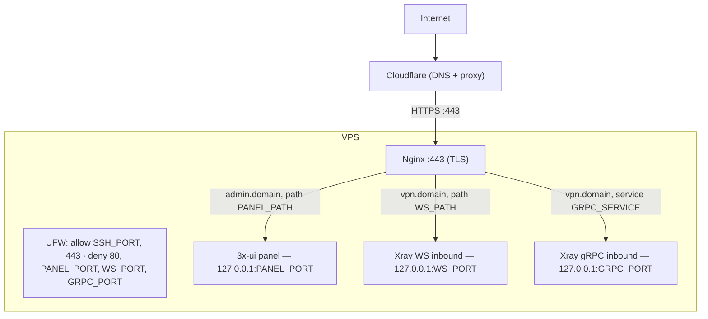

# 3x-ui-nginx-proxy


Interactive setup script that puts **Nginx** in front of an existing
**3x-ui** panel and **Xray** inbounds, behind **Cloudflare**, with a
**Let's Encrypt wildcard certificate** (DNS-01) and a locked-down **UFW**
firewall.

It does **not** install or configure 3x-ui/Xray themselves — only the
reverse proxy, TLS, firewall, and Cloudflare real-IP restoration in front of
them.

## Architecture



Two `server{}` blocks are generated, both on port 443 with the same wildcard
cert, split by `server_name`:

| Domain | Purpose | Backend |
|---|---|---|
| `<PANEL_SUBDOMAIN>.<BASE_DOMAIN>` | 3x-ui panel | `127.0.0.1:PANEL_PORT` |
| `<VLESS_SUBDOMAIN>.<BASE_DOMAIN>` | VLESS WebSocket + gRPC | `127.0.0.1:WS_PORT` / `127.0.0.1:GRPC_PORT` |

Everything else on either domain returns `404`.

## Prerequisites

- Debian/Ubuntu VPS, run as root.
- Domain managed by Cloudflare.
- Cloudflare API token with `Zone:DNS:Edit` on that zone.
- 3x-ui already installed, with panel/WS/gRPC inbounds bound to `127.0.0.1`
  (not `0.0.0.0`).

## Usage

```bash
wget https://raw.githubusercontent.com/andletenkov/3x-ui-nginx-proxy/main/setup.sh && chmod +x setup.sh && sudo ./setup.sh
```

You'll be prompted for the base domain, subdomains, panel path, email, SSH
port, internal ports (WS/gRPC default to random free ports), WS path, gRPC
service name, and your Cloudflare API token. A summary is shown before
anything is changed on disk.

At the end, the script asks you to go configure 3x-ui/Xray to match the
printed ports/paths, then optionally runs a live check (internal ports
listening + public HTTPS reachability).

## Configuration reference

| Variable | Default | Notes |
|---|---|---|
| `BASE_DOMAIN` | — | Required |
| `PANEL_SUBDOMAIN` | `admin` | Must differ from `VLESS_SUBDOMAIN` |
| `VLESS_SUBDOMAIN` | `vpn` | Must differ from `PANEL_SUBDOMAIN` |
| `PANEL_PATH` | `/my-admin` | Letters/numbers/`/`/`_`/`-` only |
| `EMAIL` | — | Let's Encrypt contact |
| `SSH_PORT` | `22` | Can't be `443`; internal ports can't equal this |
| `PANEL_PORT` | `2053` | Internal 3x-ui port |
| `WS_PORT` | random | Internal Xray WS port |
| `GRPC_PORT` | random | Internal Xray gRPC port |
| `WS_PATH` | `/api/v1/events` | Same character rules as `PANEL_PATH` |
| `GRPC_SERVICE` | `api.v1.SyncService` | `[A-Za-z0-9._-]+` |
| `CLOUDFLARE_API_TOKEN` | — | Prompted (hidden) unless already exported |

`PANEL_PORT`/`WS_PORT`/`GRPC_PORT` must all differ from each other, from
`443`, and from `SSH_PORT`.

## Generated files

| Path | Purpose |
|---|---|
| `/etc/letsencrypt/cloudflare.ini` | Cloudflare API token (`chmod 600`) |
| `/etc/letsencrypt/live/<domain>/` | Wildcard cert + key |
| `/etc/letsencrypt/renewal-hooks/deploy/nginx-reload.sh` | Reloads Nginx on renewal |
| `/etc/nginx/conf.d/cloudflare-real-ip.conf` | Trusted Cloudflare IP ranges |
| `/etc/nginx/sites-available/3xui-proxy` | Panel + VLESS server blocks |
| `/etc/nginx/sites-enabled/3xui-proxy` | Symlink (default site removed) |

Existing files are backed up as `<path>.backup-<timestamp>` before being
overwritten.

## Safety

- Every config write is atomic (temp file → `mv`), with automatic rollback
  if `nginx -t` fails.
- All internal ports are explicitly denied in UFW, so a service accidentally
  bound to `0.0.0.0` is still not reachable from the internet.
- Re-running the script is safe: certs aren't force-reissued, configs are
  backed up, and stale UFW rules from previous runs are cleaned up.

## Testing

```bash
brew install bats-core   # or: apt install bats
chmod +x tests/stubs/*
bats tests/setup.bats
```

See [`tests/README.md`](tests/README.md) for coverage details. CI
([`.github/workflows/tests.yml`](.github/workflows/tests.yml)) runs
shellcheck + these tests on every push/PR to `main`.

## Troubleshooting

| Symptom | Check |
|---|---|
| `nginx -t` fails after setup | Look for a `.backup-<timestamp>` file next to the reverted config |
| Panel returns 502 | `ss -lntp \| grep PANEL_PORT` — is 3x-ui actually listening there? |
| VLESS client can't connect | Confirm Xray is bound to `127.0.0.1` on the exact `WS_PORT`/`GRPC_PORT`, with matching `WS_PATH`/`GRPC_SERVICE` |
| Certificate issuance fails | Check the Cloudflare token's permissions and `/var/log/letsencrypt/letsencrypt.log` |
| Locked out over SSH | The script only manages UFW rules — it doesn't touch `sshd_config` |

Useful commands (also printed at the end of every run):

```bash
nginx -t
ufw status verbose
certbot renew --dry-run
ss -lntp | egrep ':443|:<PANEL_PORT>|:<WS_PORT>|:<GRPC_PORT>'
```
